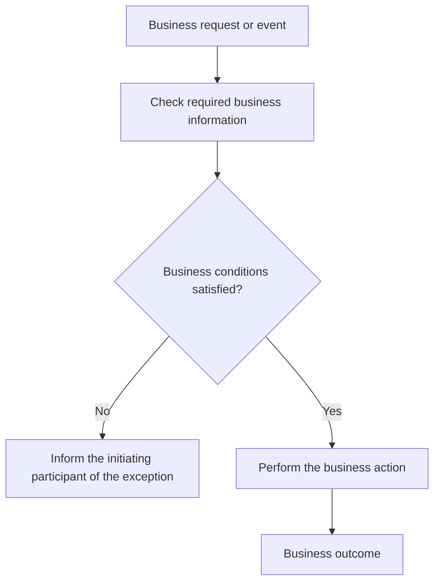

# Business-readable behavior title

[View technical behavior](../../tech-pack/behaviors/repository.behavior-name.md)

## Business summary

Explain the business event, action, and visible outcome in two or three sentences. Do not describe the code structure or invent the original requirement.

## Business trigger and actors

| Actor or participant | Trigger or role | Status |
|---|---|---|
| Business actor | Starts, receives, or supports the behavior | Confirmed/Inferred/Unknown |

## Business flow

Build this diagram from business events, decisions, affected objects, and visible outcomes. Do not copy or mechanically rename the Tech flow.

Describe the important business decisions and outcomes. Mark inferred nodes with `(Inferred)`.

## Business preconditions

| Preconditions | Business meaning | Status |
|---|---|---|
| Condition | Why the behavior can or cannot proceed | Confirmed/Inferred/Unknown |

## Business rules

### BR-001 — Business-readable rule title

- Rule:
- Business effect:
- Status: Confirmed/Inferred/Conflicting/Unknown

## Business inputs and outputs

Describe concepts, not API fields or schemas.

| Direction | Business information | Business meaning or rule | Status |
|---|---|---|---|
| Input/Output | Information concept | Meaning, condition, or limitation | Confirmed/Inferred/Unknown |

## Business outcomes

| Outcome | Who or what is affected | When it occurs | Status |
|---|---|---|---|
| Successful or alternative outcome | Actor or business object | Condition | Confirmed/Inferred/Unknown |

## Business exceptions

| Exception condition | Business impact | Visible result or recovery | Status |
|---|---|---|---|
| Condition | What does not complete or changes | What the participant observes; Unknown if unavailable | Confirmed/Inferred/Unknown |

## External business interactions

| External participant | Business purpose | Information exchanged | Business dependency | Status |
|---|---|---|---|---|
| External system or party | Purpose or Unknown | Conceptual information | Effect if unavailable or Unknown | Confirmed/Inferred/Unknown |

## Open questions

| Question | Business importance | Status |
|---|---|---|
| Unresolved item | Decision or impact it affects | Unknown/Conflicting |

## Traceability

- [Technical behavior](../../tech-pack/behaviors/repository.behavior-name.md)
- Repository commit: `git-commit-or-unknown`
- Technical implementation and source evidence remain in the linked Tech Pack.
