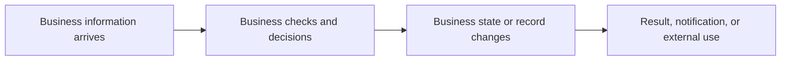

# Business data lifecycle

[View technical data lineage](../tech-pack/data/data-lineage.md)

## Business information journey

## Business data objects

| Business data object ID | Business information | Originating actor/participant | Used for | Business state changes | Destination/recipient | Status |
|---|---|---|---|---|---|---|
| BDATA-resource | Information concept | Actor/system | Business use | Change or None/Unknown | Recipient/store concept | Confirmed/Inferred/Unknown |

## Business-visible state changes

| Business data object ID | Before | Business trigger/rule | After | Visible result | Exception impact | Status |
|---|---|---|---|---|---|---|
| BDATA-resource | State or Unknown | Behavior/rule | State | Outcome | Business exception or None | Confirmed/Inferred/Unknown |

## Lifecycle gaps

List unknown ownership, retention, upstream origin, downstream use, and state meaning. Keep database, field-path, and AWS details in the Tech Pack.
