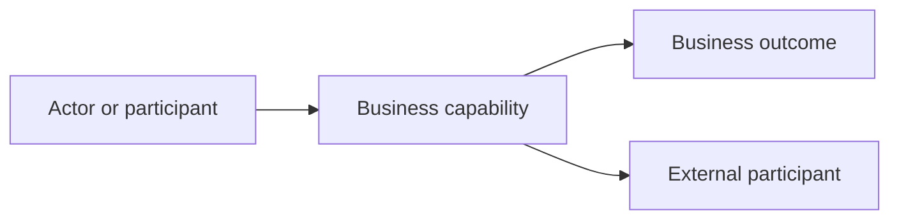

# Business capability map

## Capabilities and outcomes

| Capability | Business purpose | Actors/participants | Behavior IDs | Trigger | Business outcome | External participant | Status |
|---|---|---|---|---|---|---|---|
| Capability or Unknown | Supported purpose without invented intent | Actors | Behavior IDs | Request/event/schedule | Outcome | Participant or None | Confirmed/Inferred/Unknown |

## Capability relationships

## Capability gaps

List inferred or unknown purpose, missing upstream/downstream context, and technical behaviors with no established business meaning. See the [technical overview](../tech-pack/repository-overview.md).
