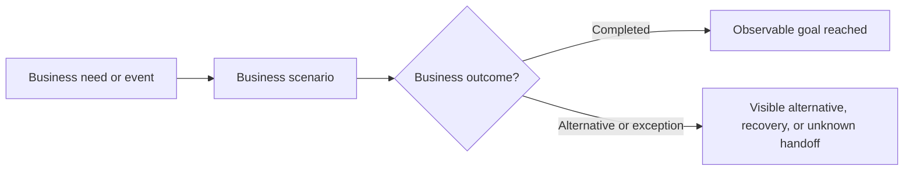

# Business journey title

## Business goal and scope

Explain the outcome pursued by the actor and the part of the journey observable in this repository. State upstream or downstream boundaries that remain Unknown.

## Actors and start/end conditions

| Actor or participant | Role | Start condition | Observable end condition | Status |
|---|---|---|---|---|
| Business participant | Journey role | Supported start or Unknown | Outcome or handoff | Confirmed/Inferred/Conflicting/Unknown |

## Journey map

Model stages, linked business Scenarios, business-object changes, handoffs, and outcomes. Do not draw handlers, services, dependencies, retries, or internal calls.

## Stages and scenarios

| Stage | Business meaning | Scenario | Object or responsibility change | Visible outcome or handoff | Status |
|---|---|---|---|---|---|
| Business stage | Why the stage matters | [Scenario](../scenarios/repository.scenario.context-outcome.md) | Business-object change or None observed | Outcome/handoff | Confirmed/Inferred/Conflicting/Unknown |

## Business-object progression

Explain meaningful object states and responsibility changes across the Journey. Link to Scenarios for decision and rule detail.

## Business handoffs and external participants

Describe business-visible handoffs and external roles. Omit protocols, resource identities, and internal dependency mechanics.

## Exceptions, degradation, and recovery limits

Explain only business-visible incomplete, delayed, reduced, inconsistent, or recoverable outcomes. Keep unsupported recovery and remote behavior Unknown.

## Open questions and journey boundaries

| Question or boundary | Business importance | Status |
|---|---|---|
| Unknown upstream/downstream stage or decision | Impact on the Journey interpretation | Unknown/Conflicting |

## Traceability

### Business scenarios

- [Business Scenario](../scenarios/repository.scenario.context-outcome.md)

### Supporting technical behaviors

- [Technical Behavior](../../tech-pack/behaviors/repository.behavior-name.md)

Repository commit: `git-commit-or-unknown`
