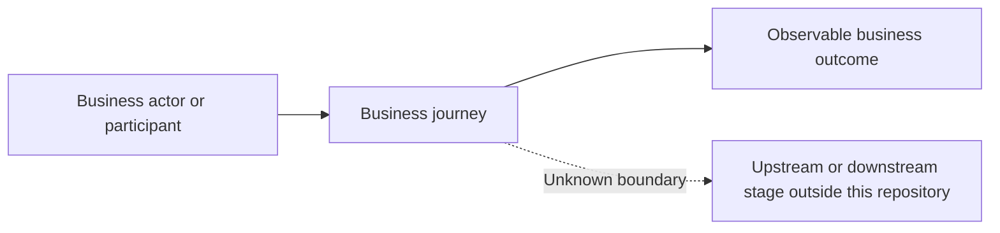

# Business overview

[Browse Journeys and Scenarios](business-catalog.md) · [View technical repository overview](../tech-pack/repository-overview.md)

## Observable business boundary

Explain the business responsibility visible in this repository and clearly mark upstream, downstream, policy, or ownership boundaries that remain Unknown. Do not describe the repository package structure.

## Business capabilities

| Capability | Business purpose | Actors or participants | Observable outcomes | Journeys | Status |
|---|---|---|---|---|---|
| Business capability | Supported purpose | Participants | Outcomes or handoffs | Journey links | Confirmed/Inferred/Conflicting/Unknown |

## Journey landscape

Draw a compact business landscape from actors and business goals to Journeys and observable outcomes. This is not the Tech connection diagram or a flow of handlers.

| Journey | Business goal | Actors | Scenarios | Observable outcome | Status |
|---|---|---|---|---|---|
| [Journey](journeys/repository.journey.business-goal.md) | Supported goal | Participants | Scenario links | Outcome/handoff | Confirmed/Inferred/Conflicting/Unknown |

## Business actors and participants

| Actor or participant | Business role | Journeys or Scenarios | Status and limitation |
|---|---|---|---|
| Person, channel, team, or business-visible system | Initiates, decides, receives, or supports an outcome | Business links | Confirmed/Inferred/Conflicting/Unknown |

## Business objects and lifecycle

Explain important business objects, meaningful state or responsibility changes, and where the observable journey begins or ends. Keep database, event, field, and storage detail in the Tech Pack.

## Shared business rules

Record only supported rules reused across Scenarios or Journeys. Preserve differences and overrides. Do not promote technical validation into business policy.

## External business interactions

Describe only participants whose role or unavailability changes a business interaction or result. Keep protocols, dependency operations, configuration identities, and field mappings in the Tech Pack.

## Business-visible exceptions and limitations

Summarize incomplete, delayed, reduced, inconsistent, false-success, or recovery-limited outcomes from the Business Model. Do not copy technical Failure or Dependency tables.

## Coverage and open questions

Explain supported Journey/Scenario coverage, Tech Behaviors with no business-visible role, partial or blocked areas, and business meaning that remains Unknown or Conflicting.
