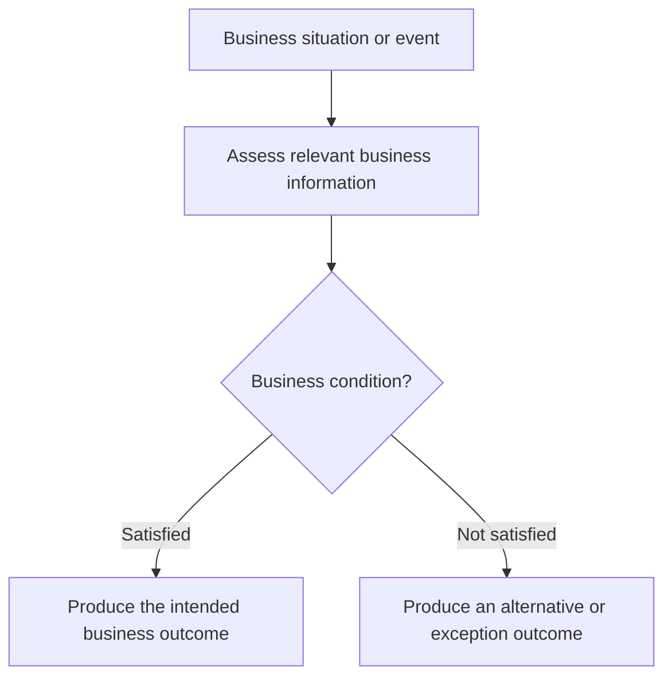

# Business scenario title

## Business purpose and context

Explain the supported business situation, goal, and visible result. Do not describe the code structure or claim an unproven historical requirement.

## Actors, trigger, and preconditions

| Actor or participant | Business event or role | Relevant precondition | Status |
|---|---|---|---|
| Business participant | Starts, receives, or supports the Scenario | Business or information condition | Confirmed/Inferred/Conflicting/Unknown |

## Business flow

Build this flow independently from business context, decisions, affected objects, and outcomes. Do not translate a Tech flow node by node.

## Business decisions and rules

Record a rule only when its business meaning is supported. Keep transport, null, formatting, and framework validation as information preconditions unless business semantics are established.

| Decision or rule | Business meaning | Effect on outcome | Status |
|---|---|---|---|
| Business condition | Supported meaning | Result or path change | Confirmed/Inferred/Conflicting/Unknown |

## Business information

Describe concepts rather than API fields, schemas, mappings, storage records, or internal objects.

## Business outcomes

| Outcome | Affected participant or object | Condition | Completion or state meaning | Status |
|---|---|---|---|---|
| Successful, alternative, or failed visible outcome | Actor/object | Business condition | Completion and meaningful state | Confirmed/Inferred/Conflicting/Unknown |

## Business-visible exceptions

Include only exceptions that change completion, visible result, recovery, timing, or business-object state. Omit recovered internal technical failures.

## External business interactions

Include only participants whose role or unavailability changes a business interaction or result. Omit internal dependency mechanics.

## Open questions

| Question | Business importance | Status |
|---|---|---|
| Unresolved business meaning or repository boundary | Decision or outcome it affects | Unknown/Conflicting |

## Traceability

### Related journeys

- [Business Journey](../journeys/repository.journey.business-goal.md)

### Supporting technical behaviors

- [Technical Behavior](../../tech-pack/behaviors/repository.behavior-name.md)

Repository commit: `git-commit-or-unknown`
