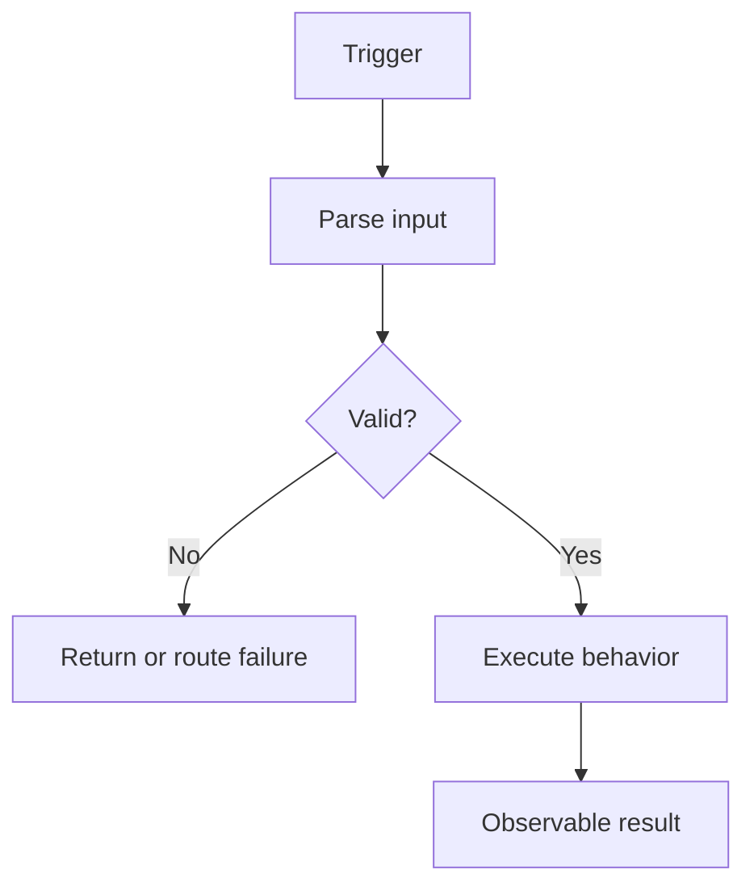

# Behavior title

## Summary

Describe the observable behavior in two or three sentences. Do not claim that this is the original historical requirement.

## Trigger and entry point

- Trigger:
- Entry point:
- Runtime wiring:
- Status:
- Evidence:
  - `path/to/file.ext:line`

## API contract

Include this section only for `entry_type: api`. Keep it short and link to the separate contract document:

[View detailed API contract](../contracts/repository.behavior-name.api-contract.md)

## BA view

Include this section only for `behavior_category: business|integration`:

[View business behavior](../../ba-pack/behaviors/repository.behavior-name.md)

## Behavior flow



Explain the important nodes and branches with source evidence.

## Inputs

Describe non-API input messages, events, records, schedules, or invocation context. API behaviors use the dedicated API contract sections.

## External HTTP field mappings

Include this section only when executable code makes an outbound HTTP call to an external system. Otherwise remove it and keep both `external_http_calls: []` and `field_mappings: []`.

Record each proven call in YAML before its mappings:

```yaml
external_http_calls:
  - call_id: "HTTP-001"
    client_operation: "ExternalCustomerClient.updateCustomer"
    method: "POST"
    target: "external-customer-system /customers"
    evidence:
      - "src/client.ext:line"
```

| ID | HTTP call | Direction | Source boundary and field(s) | Target boundary and field(s) | Transformation | Condition/default | Lossy | Status | Evidence |
|---|---|---|---|---|---|---|---|---|---|
| FM-001 | HTTP-001 | eapi-to-external | EAPI model: `field.path` | External request: `field.path` | Rename | Always; no default | No | Confirmed | `path/to/file.ext:line` |

### Unmapped, dropped, or unresolved fields

| HTTP call and field | Observed treatment | Status | Evidence or evidence needed |
|---|---|---|---|
| HTTP-001 request/response: `field.path` | Dropped/ignored/unresolved | Unknown | `path/to/file.ext:line` or required artifact |

## Preconditions and business rules

### BR-001 — Rule title

- Behavior:
- Status: Confirmed
- Evidence:
  - `path/to/file.ext:line`
  - `path/to/test.ext:line`
- Notes:

## Happy path

1. Describe the ordered executable steps.
2. Cite important transitions inline or directly below the step.

## Data access and state changes

| Operation | Resource | Key/record | State change | Status | Evidence |
|---|---|---|---|---|---|
| Read/Write | Resource | Identifier | Description | Confirmed | `path/to/file.ext:line` |

## Outputs and side effects

| Output | Destination | Contract/resource | Condition | Status | Evidence |
|---|---|---|---|---|---|
| Event/response/call | Destination | Name | Condition | Confirmed | `path/to/file.ext:line` |

## Failures, retries, and partial success

| Failure | Handling | Retry/DLQ/rollback | Status | Evidence |
|---|---|---|---|---|
| Failure condition | Observed behavior | Mechanism or Unknown | Confirmed | `path/to/file.ext:line` |

## External dependency stubs

For each dependency outside this repository, record the request/event/resource name, invocation evidence, observed contract, and unknown internal behavior.

## Open questions and conflicts

| Question or conflict | Why it matters | Status | Evidence needed |
|---|---|---|---|
| Item | Risk or impact | Unknown/Conflicting | Artifact or owner |

## Evidence index

- `path/to/file.ext:line` — what this location proves
