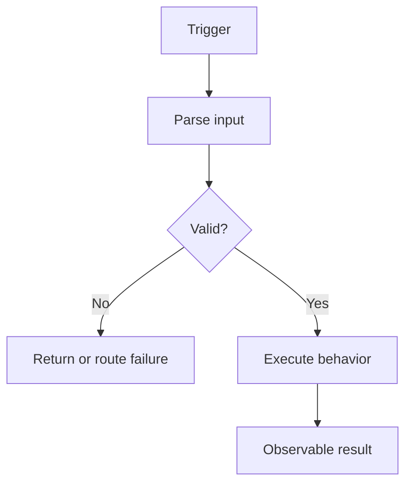

# Behavior title

## Summary

Describe the observable behavior in two or three sentences. Do not claim that this is the original historical requirement.

## Trigger and entry point

- Trigger:
- Application entry point:
- External entry declaration:
- Environment/runtime evidence:
- External reachability:
- Status:
- Evidence:
  - `path/to/file.ext:line`

## API contracts

Include this section only for `entry_type: api`. Keep it short and link to every endpoint contract implemented by this behavior:

During Tech publication, declare each stable Endpoint ID in `api_contracts` and use the exact forward path `../contracts/<endpoint-id>.api-contract.md` here even though the Contract is materialized in the next stage. Do not create an empty Contract or Endpoint Matrix stub to satisfy this link. Non-API Behaviors must omit this section and use `api_contracts: []`.

- [`METHOD /normalized/route`](../contracts/repository.method-route.api-contract.md)

[View endpoint exposure and reachability](../endpoint-matrix.md#repository-method-route)

## BA scenarios

Include this optional section only when the independent Business Model maps this Tech Behavior to one or more Scenarios. Add the same relationships to `ba_scenarios`. Omit the section and use `ba_scenarios: []` when no Scenario maps directly to this Behavior.

- [Business Scenario](../../ba-pack/scenarios/repository.scenario.context-outcome.md)

## Behavior flow

Explain the important nodes and branches with source evidence.

## Inputs

Describe non-API input messages, events, records, schedules, or invocation context. API behaviors use the dedicated API contract sections.

## External HTTP calls and mappings

Include this section only when executable code makes an outbound HTTP call to an external system. Otherwise remove it and keep both `external_http_calls: []` and `field_mappings: []`.

Use one row per remote operation used by this behavior, regardless of mapping count. Summarize why the operation matters and any material transformation or limitation. Keep call identity, executable-usage detail, and exact field-by-field mappings in the repository field document.

| Call | Why this behavior uses it | Usage IDs | Key transformation or limitation | Status | Evidence |
|---|---|---|---|---|---|
| [HTTP-001](../field-validation-and-mapping.md#http-001) | Behavior-relevant purpose | HTTP-001-U01 | Key rename/default/conversion, mapping count, or unresolved field | Confirmed | `path/to/file.ext:line` |

## Preconditions and business rules

### BR-001 — Rule title

- Behavior:
- Status: Confirmed
- Evidence:
  - `path/to/file.ext:line`
  - `path/to/test.ext:line`
- Notes:

## Happy path

1. Describe the ordered executable steps.
2. Cite important transitions inline or directly below the step.

## Data access and state changes

| Operation | Resource | Key/record | State change | Status | Evidence |
|---|---|---|---|---|---|
| Read/Write | Resource | Identifier | Description | Confirmed | `path/to/file.ext:line` |

## Outputs and side effects

| Output | Destination | Contract/resource | Condition | Status | Evidence |
|---|---|---|---|---|---|
| Event/response/call | Destination | Name | Condition | Confirmed | `path/to/file.ext:line` |

## Failures, retries, and partial success

Keep this Behavior's executable failure story here and link its repository-wide Pattern when reconciled. Add those stable IDs to `failure_patterns`; leave `failure_patterns: []` when no Pattern applies. Do not copy the complete taxonomy.

| Failure or Pattern | Handling and visible result in this Behavior | State/retry/recovery | Status | Evidence |
|---|---|---|---|---|
| [FAIL-001](../failure-taxonomy.md#fail-001) or behavior-specific failure | Observed handling/result | State outcome and mechanism or Unknown | Confirmed | `path/to/file.ext:line` |

## External dependencies

Include one concise row per synthesized Dependency used by this Behavior and use the same `dependency_id` in `external_dependencies`. Explain only the usage-specific purpose and impact; keep the shared role, Operations, remote Unknowns, and full availability model in External Dependency Contracts. Remove this section and use `external_dependencies: []` when none applies.

| Dependency | Why this Behavior uses it | Criticality | Unavailability effect in this Behavior | Status | Evidence |
|---|---|---|---|---|---|
| [DEP-001](../external-dependency-contracts.md#dep-001) | Usage-specific purpose | Required/Degradable/Optional/Unknown | Failure, fallback, partial result, or Unknown | Confirmed | `path/to/file.ext:line` |

## Related repository knowledge

Include only relevant links, such as the data lifecycle, field rules and external HTTP mappings, runtime configuration, dependency contracts, or failure taxonomy. Remove this optional section when no repository-level reference applies.

## Open questions and conflicts

| Question or conflict | Why it matters | Status | Evidence needed |
|---|---|---|---|
| Item | Risk or impact | Unknown/Conflicting | Artifact or owner |

## Evidence index

- `path/to/file.ext:line` — what this location proves
