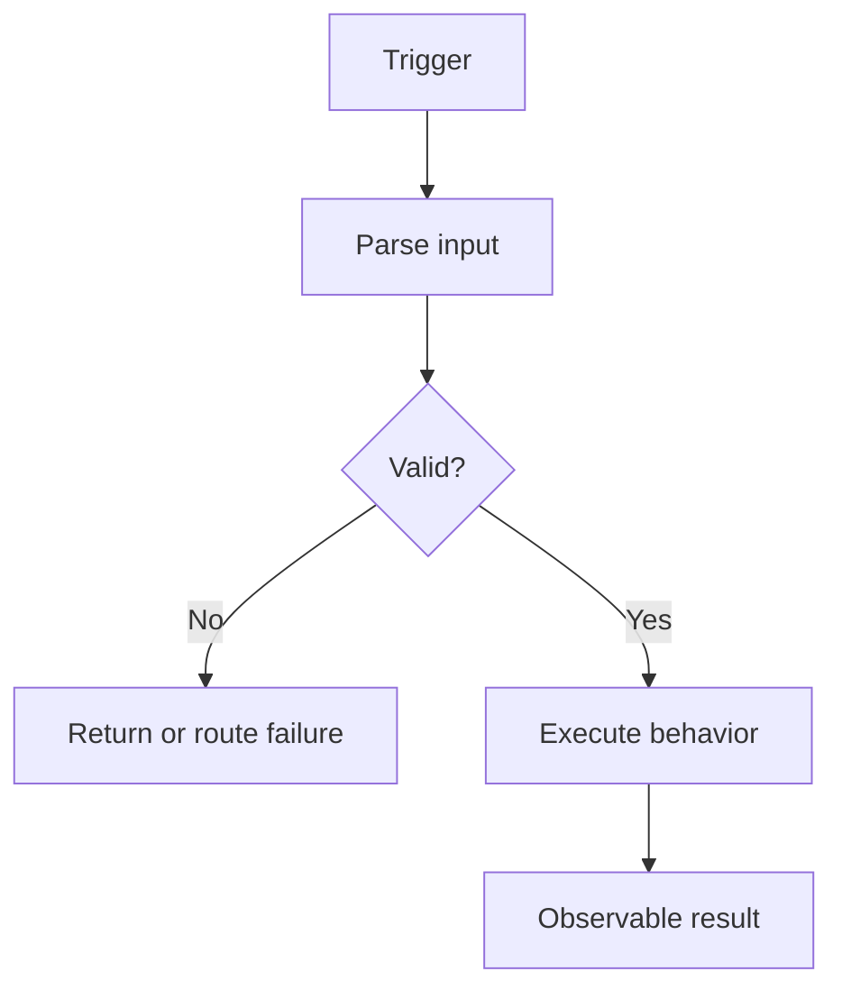

# Behavior title

## Summary

Describe the observable behavior in two or three sentences. Do not claim that this is the original historical requirement.

## Trigger and entry point

- Trigger:
- Entry point:
- Runtime wiring:
- Status:
- Evidence:
  - `path/to/file.ext:line`

## API contracts

Include this section whenever `endpoint_ids` is nonempty; it is mandatory for `entry_type: api`. List every endpoint that invokes or routes into this behavior and link to its endpoint-owned contract:

- `EP-POST-resource` — [View API contract](../endpoints/contracts/EP-POST-resource.api-contract.md)

## BA view

Include this section only for `behavior_category: business|integration`:

[View business behavior](../../ba-pack/behaviors/repository.behavior-name.md)

## Behavior flow

Explain the important nodes and branches with source evidence.

## Inputs

Describe non-API input messages, events, records, schedules, or invocation context. API behaviors use the dedicated API contract sections.

## External HTTP field mappings

Include this section only when `external_mapping_ids` is nonempty. Summarize the interaction and link to the canonical [External HTTP mapping matrix](../fields/external-http-mapping-matrix.md). List `HTTP-` and `MAP-` IDs; do not duplicate the full mapping table.

## Related repository knowledge

- [Endpoint matrix](../endpoints/endpoint-matrix.md)
- [Data assets](../data/data-asset-catalog.md), [data lineage](../data/data-lineage.md), and [state transitions](../data/state-transition-matrix.md)
- [Field catalog](../fields/field-catalog.md), [validation rules](../fields/validation-rule-matrix.md), and [field lineage](../fields/field-lineage.md)
- [Runtime configuration](../runtime/runtime-config-matrix.md)
- [External dependencies](../dependencies/dependency-matrix.md)
- [Failure taxonomy](../reliability/failure-taxonomy.md)

## Preconditions and business rules

### VR-rule-id — Rule title

- Behavior:
- Status: Confirmed
- Evidence:
  - `path/to/file.ext:line`
  - `path/to/test.ext:line`
- Notes:

## Happy path

1. Describe the ordered executable steps.
2. Cite important transitions inline or directly below the step.

## Data access and state changes

| Operation | Resource | Key/record | State change | Status | Evidence |
|---|---|---|---|---|---|
| Read/Write | DATA- ID / resource | Identifier | Description | Confirmed | `path/to/file.ext:line` |

## Outputs and side effects

| Output | Destination | Contract/resource | Condition | Status | Evidence |
|---|---|---|---|---|---|
| Event/response/call | Destination | Name | Condition | Confirmed | `path/to/file.ext:line` |

## Failures, retries, and partial success

| Failure ID | Failure | Handling | Retry/DLQ/rollback | Status | Evidence |
|---|---|---|---|---|---|
| FAIL- ID | Failure condition | Observed behavior | Mechanism or Unknown | Confirmed | `path/to/file.ext:line` |

## External dependency stubs

List relevant `DEP-` IDs, summarize their role, and link to their canonical stubs under `../dependencies/stubs/`. Do not reproduce the full dependency contract here.

## Open questions and conflicts

| Question or conflict | Why it matters | Status | Evidence needed |
|---|---|---|---|
| Item | Risk or impact | Unknown/Conflicting | Artifact or owner |

## Evidence index

- `path/to/file.ext:line` — what this location proves
