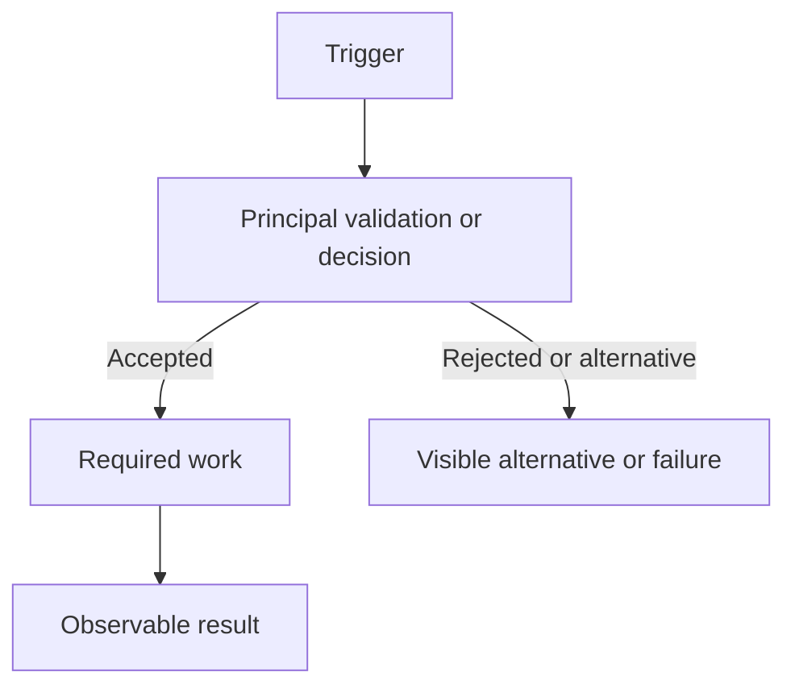
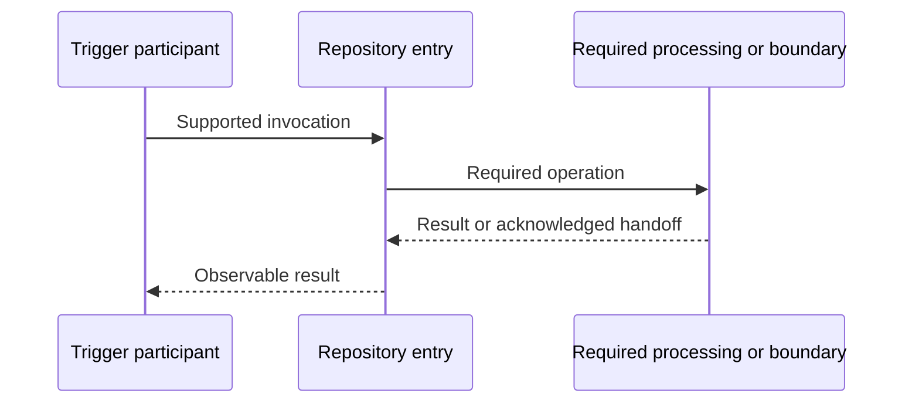

# Behavior title

## Summary

Explain what triggers this Behavior, what observable result it produces, and why it matters in two or three connected sentences. Do not lead with classes, methods, tables, or evidence status.

## Trigger, result, and scope

- **Trigger:** Supported invocation or event.
- **Observable result:** Response, handoff, state change, or side effect.
- **Repository boundary:** What is controlled here and what remains external.
- **Important limitation:** Material Unknown or Conflict, when applicable.

Support the summary with one grouped Source Note such as [E1](#e1).

## Main path

Describe the normal successful path as a short ordered narrative. Put the principal decisions and observable result before implementation detail. Do not call one Variant the default unless code, configuration, or tests establish that selection.

1. Receive or observe the trigger.
2. Apply the key decision or rule.
3. Perform the necessary state or boundary work.
4. Produce the observable result.

## Behavior flow

Model decisions, result-changing branches, evidence-backed state changes, important side effects, and observable results. Do not use classes and methods as the primary nodes. This is a first-class view and is not the source metadata for the Implementation Sequence.

## Implementation sequence

Independently show runtime participants, entry dispatch, ordered calls and returns, persistence and external boundaries, transaction position, and material exception propagation. Use exact confirmed Java symbols when available and logical runtime participants for other languages. Keep unresolved framework or dynamic dispatch as an explicit boundary.

Support this sequence with Source Notes separate from the Behavior Flow evidence. Do not mechanically translate the flowchart nodes into participants.

## Exception and failure handling

Explain the material exception and failure paths on this Behavior's executable sequence. Keep repository-wide grouping in Failure Taxonomy.

| Failure or exception | Origin | Handler and action | Visible result | State and side effects | Retry/recovery | Deep dive |
|---|---|---|---|---|---|---|
| Failure condition or exception type | Exact call, boundary, or condition | Catch, advice, framework handler; translate/propagate/swallow/degrade/retry | API, event, async, degraded, false-success, or Unknown | Unchanged, rolled back, partial, committed, side effect, or Unknown | Observed mechanism or Unknown | Contract, `FAIL-*`, Dependency, Lifecycle, or [E6](#e6) |

## Material variants and risks

Include this section only when configuration, market, country, tenant, channel, profile, feature flag, Dependency outcome, or another proven condition materially changes this Behavior. Summarize the difference and link the repository Variant or Failure detail; do not copy configuration or failure tables.

| Variant or hotspot | Selection / trigger | Difference from the normal path | Observable impact | Deep dive |
|---|---|---|---|---|
| Variant or material risk *(Unknown)* | Supported condition | Rule, Dependency, Mapping, state, output, or recovery difference | Caller/business/state impact | Runtime Config, Failure, Dependency, Lifecycle, or Contract link [E2](#e2) |

## Implementation reference

Keep only applicable subsections. API caller fields belong in API Contracts. Repository-wide Dependency, Mapping, Lifecycle, and Failure detail belongs in the linked specialist documents.

### Inputs

Describe non-API messages, records, schedules, or invocation context. For API Behaviors, link the Contract instead of copying its field tables.

### Preconditions and business rules

Record rules that materially change the path or result. Use connected prose or a compact list; do not create one table row per code check.

### Data access and processing

Keep Actions and data movement separate from Object State.

| Action | Role | Object/resource | Input or source | Output or destination | State effect |
|---|---|---|---|---|---|
| `ACT-001` | Read/Observe/Validate/Transform/Map/Persist/Delete/Invoke/Emit/Route/Other | Object/resource | Input or boundary | Output, store, or boundary | `TRANS-001`, None observed, or Unknown [E3](#e3) |

### Object state transitions

Include only evidence-backed object-condition changes. Omit this subsection when no Transition applies.

| Transition | Object | From state | To state | Causing action and condition | Observable or persisted result |
|---|---|---|---|---|---|
| [`TRANS-001`](../data-lifecycle.md#trans-001) *(Inferred)* | `OBJ-001` | `STATE-001` | `STATE-002` | `ACT-001`; condition | Result [E3](#e3) |

### External HTTP calls and mappings

Include only when `external_http_calls` is non-empty. Use one row per Remote Operation, regardless of Mapping count.

| Call | Why this Behavior uses it | Usage IDs | Key transformation or limitation |
|---|---|---|---|
| [HTTP-001](../field-validation-and-mapping.md#http-001) | Behavior-relevant purpose | HTTP-001-U01 | Key transformation, mapping count, or unresolved field [E4](#e4) |

### External dependencies

Include only when `external_dependencies` is non-empty. Keep shared role and availability detail in External Dependency Contracts.

| Dependency | Usage-specific purpose | Criticality | Unavailability effect |
|---|---|---|---|
| [DEP-001](../external-dependency-contracts.md#dep-001) *(Unknown)* | Purpose | Required/Degradable/Optional/Unknown | Failure, fallback, partial result, or Unknown [E5](#e5) |

### Outputs and side effects

Include only outputs or side effects that are not already clear from Main Path and related Contracts.

## Related documents

### API contracts

<!-- TEMPLATE: Keep only for API Behaviors. Use durable reader wording and stable `../contracts/<endpoint-id>.api-contract.md` paths. Delete this comment. -->

- [`METHOD /normalized/route`](../contracts/repository.method-route.api-contract.md)
- [Endpoint exposure and reachability](../endpoint-matrix.md#repository-method-route)

### Java implementation

<!-- TEMPLATE: Keep only for Java Behaviors with reconciled JIMPL identities. Delete this comment. -->

- [`JIMPL-001` implementation slice](../java-implementation-map.md#jimpl-001)

### Runtime configuration impacts

<!-- TEMPLATE: Keep only when runtime_config_impacts is non-empty. Delete this comment. -->

- [`CFG-001-I01` API/Behavior impact](../runtime-config-matrix.md#cfg-001-i01)

### BA scenarios

<!-- TEMPLATE: Keep only when the independent Business Model maps this Behavior to Scenarios. Delete this comment. -->

- [Business Scenario](../../ba-pack/scenarios/repository.scenario.context-outcome.md)

Add only relevant Lifecycle, Mapping, Runtime Config, Dependency, Failure, Contract, or Scenario links. Remove unused subsections.

## Open questions and conflicts

Include only material questions that affect interpretation, implementation, or impact analysis. Omit the section when none remains.

## Source notes

 **E1** — `path/to/entry-point.ext:10-35` supports the trigger, main path, and observable result.

 **E2** — `path/to/variant-or-failure.ext:20-44` supports the material Variant or risk difference.

 **E3** — `path/to/processing.ext:60-96` supports the processing and state-transition assessment.

 **E4** — `path/to/http-client.ext:20-54` supports the outbound operation and Mapping summary.

 **E5** — `path/to/dependency.ext:18-49` supports Dependency usage and unavailability impact.

 **E6** — `path/to/failure.ext:30-52` supports the failure handling and visible result.
