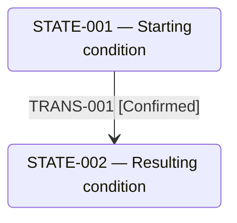
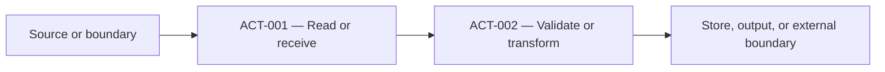

# Data and state lifecycle

## Object landscape

Start with the repository's important business objects, records, events, jobs, and state resources. Keep the object state model, processing actions, and data movement visibly separate.

| Object ID | Logical object or resource | Type | Source, ownership, and store | Behaviors | State model | Processing and data movement | Details |
|---|---|---|---|---|---|---|---|
| `OBJ-001` | Human-readable identity | business-object/record/event/job/resource/other | Origin, owner, and store | Behavior links | Established/Not established | Summary [E1](#e1) | [Details](#obj-001) |

## `OBJ-001` — Object name

### Object identity and ownership

Explain what the object is, where it originates, who owns or observes it, where it is stored, and where the repository boundary ends.

### State vocabulary

| State ID | State | Basis | Definition or derivation | Persistence or observability |
|---|---|---|---|---|
| `STATE-001` *(Inferred)* | Object condition | Derived | Exact meaning or derivation | Field, record existence, predicate, or direct observation [E2](#e2) |

### State lifecycle diagram

Include this section only when at least one Confirmed or Inferred Transition is established. Every node and edge must use registered identities. Remove the section when no transition is established.

<!-- TEMPLATE: Replace the object and IDs below. Keep the lifecycle-state-diagram tag so the mechanical projection Validator can bind this diagram to one Object. Remove this explanatory sentence but keep the tag. -->
<!-- lifecycle-state-diagram: OBJ-001 -->

### State transitions

<!-- TEMPLATE: Add one stable  anchor for every Transition row, immediately before the row or its short explanation. Remove this instruction before publication. -->

| Transition ID | From state | To state | Triggering behavior | Causing action(s) | Condition | Result and consistency impact |
|---|---|---|---|---|---|---|
| `TRANS-001` | `STATE-001` | `STATE-002` | Behavior link | `ACT-001` | Condition | Persisted/observable result and consistency impact [E3](#e3) |

When no Transition is established, omit the state diagram and transition table and write exactly:

No object state transition was established from repository evidence.

### Processing and data movement

Describe what the repository does to the object and where the data moves. Processing nodes use `ACT-*`; stores and external boundaries may be shown as resources, but neither is an Object State.

<!-- TEMPLATE: Replace the object and Action IDs below. Keep the lifecycle-processing-diagram tag so the mechanical projection Validator can bind this diagram to one Object. Remove this explanatory sentence but keep the tag. -->
<!-- lifecycle-processing-diagram: OBJ-001 -->

| Action ID | Role | Behavior | Input or source | Output or destination | Related transition | Condition |
|---|---|---|---|---|---|---|
| `ACT-001` *(Unknown)* | Read/Observe/Validate/Transform/Map/Persist/Delete/Invoke/Emit/Route/Other | Behavior link | Input or source | Output or destination | `TRANS-001` or None | Condition [E4](#e4) |

### Consistency and unresolved questions

Explain transaction boundaries, concurrent updates, partial writes, retention, ordering, unknown ownership, ambiguous state definitions, and deliberately unproven lifecycle relationships.

## Source notes

 **E1** — `path/to/object-or-resource.ext:10-28` supports object identity, ownership, and storage boundaries.

 **E2** — `path/to/state-definition.ext:16-42` supports the state definition or derivation.

 **E3** — `path/to/state-change.ext:35-72` supports the transition, causing action, and observable result.

 **E4** — `path/to/processing.ext:44-91` supports the processing and data-movement actions.
