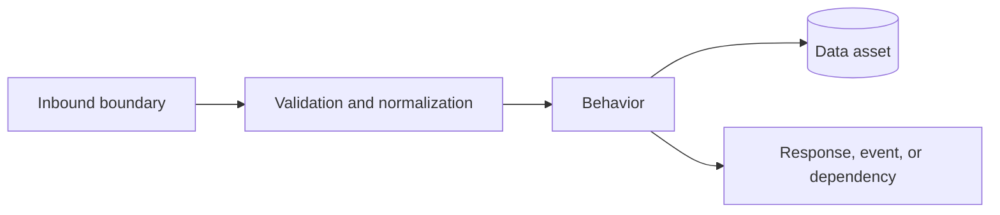

# Data lineage

## Repository data flow

Use boundary, behavior, data asset, field, and dependency IDs in node labels where practical.

## Object-level lineage

| Lineage ID | Source boundary/asset | Behavior | Transformation | Target boundary/asset | Condition/default | Lossy | Related field/rule IDs | Status | Evidence |
|---|---|---|---|---|---|---:|---|---|---|
| LINEAGE-resource | Source ID | Behavior ID | Parse/normalize/calculate/persist/emit | Target ID | Condition or None | Yes/No/Unknown | FIELD-/VR- IDs | Confirmed/Inferred/Unknown | `path/to/file.ext:line` |

## Transaction and partial-success boundaries

| Behavior | Ordered writes/calls/events | Transaction boundary | Failure point | Remaining state or side effect | Status | Evidence |
|---|---|---|---|---|---|---|
| Behavior ID | Operations | Transaction/none/Unknown | Failure ID | Rollback/partial/Unknown | Confirmed/Inferred/Unknown | `path/to/file.ext:line` |

## Lineage gaps

List opaque mappers, generated schemas, unavailable shared libraries, dynamic serializers, and external state ownership that prevents complete lineage.
