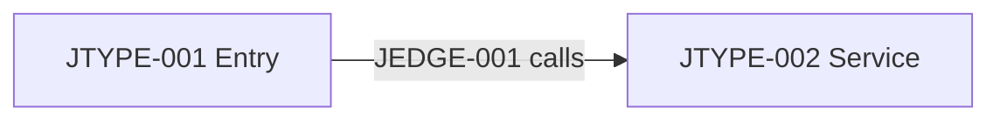

# Java implementation map

Use this document only for a Java repository. Publish behavior-scoped production implementation relationships, not a repository-wide Class inventory or raw LSP log.

## Java implementation landscape

Explain the Java project model, relevant modules/source sets, semantic-navigation coverage, and the implementation layers used by executable Behaviors. Keep unresolved generated, proxy, reflection, and framework boundaries visible. Support the model with grouped evidence such as [E1](#e1).

## Behavior and API implementation index

| Implementation | Behavior | Endpoint or trigger | Entry symbol | Principal Java types | Details |
|---|---|---|---|---|---|
| `JIMPL-001` | Behavior link | Endpoint link or non-API trigger | Exact fully qualified method signature | `JTYPE-001`, `JTYPE-002` | [Implementation slice](#jimpl-001) |

## Shared Java type index

Define every production type once even when several Behaviors use it.

| Java type | Fully qualified class | Behavior role | Related Behaviors/Endpoints | Principal relations | Details |
|---|---|---|---|---|---|
| `JTYPE-001` | `com.example.Type` | Entry/service/repository/client/mapper/config/other | Links | `JEDGE-001` | [Implementation slice](#jimpl-001) |

## `JIMPL-001` — Behavior implementation slice

### Entry symbol and framework binding

Explain the exact entry signature and the annotation, configuration, registration, or framework binding that makes it executable.

### Class dependency graph

| Edge | Source | Relation | Target | Binding/condition | Affected Behavior/Endpoint |
|---|---|---|---|---|---|
| `JEDGE-001` | `JTYPE-001` | calls/injects/implements/extends/creates/framework-dispatch/generated-delegate | `JTYPE-002` | Qualifier/Profile/runtime condition or None | Links |

### Interface and DI selection

Record Interface candidates, actual binding evidence, and unresolved implementation selection. Names or type compatibility alone do not prove the runtime choice.

### Related Endpoint, Behavior, Config, and external boundary

Link the Tech Behavior and its [Implementation sequence](behaviors/repository.behavior-name.md#implementation-sequence), Endpoint/Contract, `CFG-*` impacts, and related `HTTP-*` or `DEP-*` identities without copying their documents.

### Dynamic and generated boundaries

Record proxy/AOP, reflection, annotation dispatch, Lombok, MapStruct, Spring Data, or absent generated sources that limit the static implementation map.

## Source notes

 **E1** — `path/to/java/source.java:10-40` supports the entry, type relationship, and binding.
