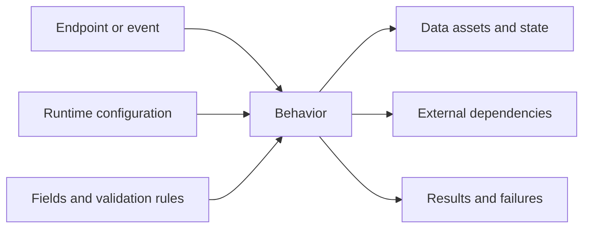

# Repository knowledge map

## Start here

Describe how a BA, developer, tester, or change analyst should navigate this pack. Link to [coverage and limitations](coverage-report.md) before claiming complete understanding.

## Repository at a glance

| Question | Answer | Status | Detail |
|---|---|---|---|
| What does this repository do? | Observable responsibility | Confirmed/Inferred/Unknown | [Tech overview](tech-pack/repository-overview.md) |
| Which business capabilities are supported? | Capability summary | Confirmed/Inferred/Unknown | [BA overview](ba-pack/business-overview.md) |
| How is it invoked? | Endpoint/event/queue/schedule summary | Confirmed/Inferred/Unknown | [Endpoint matrix](tech-pack/endpoints/endpoint-matrix.md) |
| Where does data come from and go? | Lifecycle summary | Confirmed/Inferred/Unknown | [Data lineage](tech-pack/data/data-lineage.md) |
| What can fail? | Failure summary | Confirmed/Inferred/Unknown | [Failure taxonomy](tech-pack/reliability/failure-taxonomy.md) |

## Knowledge navigation

| Need | Primary document |
|---|---|
| Understand business capabilities | [BA capability map](ba-pack/capability-map.md) |
| Follow a business flow | [BA behavior catalog](ba-pack/behavior-catalog.md) |
| Follow implementation behavior | [Tech behavior catalog](tech-pack/behavior-catalog.yaml) |
| Understand every inbound API | [Endpoint matrix](tech-pack/endpoints/endpoint-matrix.md) |
| Understand request/response fields | [Field catalog](tech-pack/fields/field-catalog.md) |
| Understand validation | [Validation rule matrix](tech-pack/fields/validation-rule-matrix.md) |
| Understand state and data movement | [Data lineage](tech-pack/data/data-lineage.md) and [state transitions](tech-pack/data/state-transition-matrix.md) |
| Understand runtime differences | [Runtime config matrix](tech-pack/runtime/runtime-config-matrix.md) |
| Understand external systems | [Dependency matrix](tech-pack/dependencies/dependency-matrix.md) |
| Understand failure handling | [Failure taxonomy](tech-pack/reliability/failure-taxonomy.md) |

## Relationship map

## Coverage and known gaps

Summarize the most important `Unknown`, `Conflicting`, excluded, and blocked areas. Link to the [full coverage report](coverage-report.md) and [canonical manifest](knowledge-manifest.yaml).
