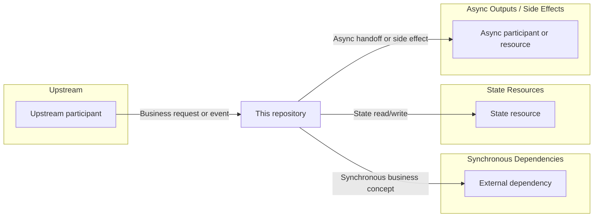

# Repository knowledge overview

## Observable responsibility

Summarize what the repository appears to do from executable evidence. Separate confirmed responsibilities from inferred business purpose.

## Technology and deployment

| Area | Observed value | Status | Evidence |
|---|---|---|---|
| Runtime/framework/IaC | Value | Confirmed | `path/to/file.ext:line` |

## Entry-point inventory

| Entry point | Trigger | Behavior ID | Classification | Status | Evidence |
|---|---|---|---|---|---|
| Handler or route | API/event/queue/schedule | repository.behavior | Business/integration/technical | Documented | `path/to/file.ext:line` |

## Endpoint exposure summary

Include this section whenever any endpoint-layer evidence exists. Separate reader-facing endpoints from aggregated protocol support without calling an application route public or deployed unless external reachability is Confirmed.

| Category | Count | Interpretation | Details |
|---|---|---|---|
| Application endpoints | Count | Executable application routes | [Endpoint Matrix](endpoint-matrix.md) |
| Meaningful external exposures | Count | Reader-relevant external-only entries | [Endpoint Matrix](endpoint-matrix.md) |
| Aggregated protocol-support declarations | Count | Preflight, CORS, or other support operations represented as a summary | [Protocol-support summary](endpoint-matrix.md#protocol-support-summary) or Not observed |
| Unresolved or conflicting exceptions | Count | Records kept visible because classification or wiring is incomplete | [Endpoint Matrix](endpoint-matrix.md) |

Optionally list a small number of important endpoint or exception links. Do not reproduce the full Matrix or one row per ordinary protocol-support declaration.

## Behavior summary

| Behavior ID | Summary | Inputs | Outputs and side effects | Tech behavior | BA scenarios | API contracts |
|---|---|---|---|---|---|---|
| repository.behavior | Observable behavior | Boundary | Boundary | [Tech](behaviors/repository.behavior.md) | Scenario links or N/A | Endpoint contract links or N/A |

## Knowledge pack index

| Knowledge area | Document | Availability | What it explains |
|---|---|---|---|
| Endpoints | [Endpoint matrix](endpoint-matrix.md) | Available/Not observed/Not applicable | Application routes, external entries, deployment evidence, reachability, and endpoint contracts |
| Data and state | [Data lifecycle](data-lifecycle.md) | Available/Not observed | Object movement and state transitions |
| Fields | [Field validation and mapping](field-validation-and-mapping.md) | Available/Not observed | Field rules and proven outbound HTTP mappings |
| Runtime configuration | [Runtime configuration matrix](runtime-config-matrix.md) | Available/Not observed | Configuration that changes behavior |
| External dependencies | [Dependency contracts](external-dependency-contracts.md) | Available/Not observed | External participants/resources, shared operations, criticality, and availability impact |
| Failures | [Failure taxonomy](failure-taxonomy.md) | Available/Not observed | Repository-wide failure patterns, state/retry outcomes, recovery, and risk attention |

Remove links for documents that are not generated; keep their availability so absence is explicit.

## External connections

Build this section only from the Repository Connection Model in `repository-synthesis.md`. Do not publish a paragraph that merely lists system, resource, class, Host, or configuration names.

### System context

Replace the example nodes and edges with one repository-specific context diagram. Keep the repository in the center, retain only applicable groups, use actual control/data direction, and label each edge with the primary exchanged concept and interaction role. Use solid edges for Confirmed connections and dashed edges for Inferred, Conflicting, or Unknown connections. Draw one edge per logical connection rather than per Operation or Behavior.

<!-- TEMPLATE: Replace every sample node and edge below with repository-specific content, remove unused groups, and delete this comment. -->

### Connection matrix

Use one row per logical connection. Group only when participant/resource, direction, boundary type, interaction role, and configuration-selection semantics are equivalent. Keep different roles or directions separate even when the participant name is the same.

| Connection | Direction / boundary | Interaction role | Capabilities / Behaviors | Exchanged concepts | Config / variants | Criticality and failure impact | Deep dive |
|---|---|---|---|---|---|---|---|
| External participant or resource | Inbound/Outbound/Bidirectional — boundary type | Business request/response, Synchronous business dependency, Asynchronous handoff, State read/write, Auxiliary side effect, Identity/security support, Operational support, or Unknown | Capability and Behavior links | Business/data concepts | Target/implementation/path selection or None observed | Required/Degradable/Optional/Unknown/N/A; blocking, degradation, partial state, or Unknown | Applicable Endpoint Matrix, API Contract, Tech Behavior, Dependency Operation, Field Mapping, Data Lifecycle, Runtime Config, and Failure links |

Use `N/A` only for a pure inbound trigger. Keep unresolved candidates visible, but do not promote configuration-only or name-only observations into Confirmed connections. Link to deeper documents rather than copying Operation, Mapping, Lifecycle, Config, or Failure detail.

## Failure and consistency highlights

Summarize supported High-attention and material Unknown failure themes, including partial/committed state, swallowed or false-success outcomes, unsafe repetition, and recovery gaps. Link Failure Taxonomy instead of copying its Pattern index. Remove this section when no material failure document is generated.

## Shared rules and components

Publish only items from the Shared Behavior Model. An item must affect at least two Behaviors or independently exposed entry paths and materially shape observable behavior. If no item qualifies, write `Not observed` and omit the empty table.

### Shared rules

| Shared rule | Observable effect | Capabilities / Behaviors | Variations or overrides | Configuration / source of truth | Status | Deep dive |
|---|---|---|---|---|---|---|
| Human-readable rule | Shared validation, decision, authorization, transformation, state, output, or failure effect | Capability and Behavior links | Behavior-specific difference or None observed | Executable rule/configuration source | Confirmed/Inferred/Conflicting/Unknown | Relevant Behavior, Contract, Field, Config, Lifecycle, or Failure links |

### Shared behavior-shaping components

Lead with the component's role; include implementation names only to help developers locate the shared mechanism.

| Component and role | Capabilities / Behaviors | Observable behavior impact | Config / variants | Change blast radius and limitations | Status | Deep dive |
|---|---|---|---|---|---|---|
| Behavior role — implementation identity | Capability and Behavior links | Path, result, state, boundary, or recovery effect | Binding/profile/target or None observed | Outcomes affected by a change and material Unknowns | Confirmed/Inferred/Conflicting/Unknown | Relevant Behavior, Field, Config, Lifecycle, Dependency, or Failure links |

Do not list logging, ordinary monitoring, generated code, framework glue, trivial wrappers, generic serializers, or utilities that do not change observable behavior.

## Coverage and limitations

Account for excluded, duplicate, generated, dynamic, unreadable, and blocked entry points. Do not claim complete coverage unless every discovered executable entry point has a catalog disposition.

## Repository-level open questions

List unknown responsibilities, conflicting wiring, missing schemas, environment-defined dependencies, and behavior that may live outside the repository.
