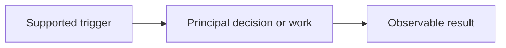
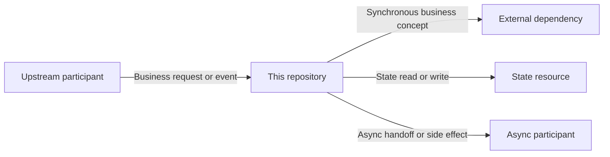

# Repository knowledge overview

## Repository in 5 minutes

Explain the repository's observable responsibility, boundary, principal inputs, and principal outcomes in a short narrative. Name the major Capabilities a developer should understand first. Do not begin with framework, file, Endpoint, Dependency, or Schema inventories.

Use one small orientation list only when it improves scanning:

- **Responsibility:** Observable responsibility.
- **Boundary:** Where this repository starts and stops.
- **Start here:** Links to the most important Capability paths.
- **Important limitation:** One material coverage boundary, or omit this line.

## Capability paths

Publish one subsection per Capability from the completed Capability Path Model. A Capability is not a Behavior inventory row. Explain its goal, supported entry or trigger, normal execution path, important decisions, observable result, and relevant Behaviors.

### Capability name

Describe the normal path in connected prose. Call a route the default or primary path only when repository evidence establishes that selection. Otherwise present the supported alternatives without choosing one.

- **Supporting Behaviors:** [Tech Behavior](behaviors/repository.behavior.md)
- **Contracts and endpoints:** Relevant API Contract or Endpoint Matrix links, when applicable.
- **State and side effects:** Short result with a Data Lifecycle link, when applicable.
- **Variants and risks:** Links to the relevant sections below.

## Behavior variants

Show only code-supported axes that change observable execution, validation, rules, Dependency selection, Mapping, state, output, or failure behavior. Use `Market`, `Country`, `Tenant`, `Channel`, `Profile`, `Environment`, `Feature Flag`, or `Other` as an explanatory axis—not as evidence by itself.

| Variant | Selection source | Scope and baseline | Observable difference | Affected capabilities / Behaviors | Deep dive |
|---|---|---|---|---|---|
| Variant name *(Unknown)* | Input/configuration/profile/wiring | Proven baseline, multiple supported paths, or no repository-proven default | Changed rule, path, dependency, mapping, state, output, or failure | Capability and Behavior links | Runtime Config, Behavior, Contract, Mapping, Lifecycle, Dependency, or Failure link [E1](#e1) |

When no behavior-changing Variant is established, say `No behavior-changing variant was established from repository evidence.` and omit the table.

## Risk hotspots

Lead with evidence-supported High-attention and materially Unknown risks from Failure, Dependency, and Lifecycle synthesis. Focus on caller visibility, partial or committed state, false success, unsafe repetition, and recovery gaps. Do not invent a new score.

| Hotspot | Affected capability | Caller or business impact | State / retry / recovery concern | Deep dive |
|---|---|---|---|---|
| Risk or material Unknown | Capability link | Visible error, degraded result, success with loss, or async-only outcome | Partial/committed state, unsafe/unknown retry, or recovery gap | Failure, Dependency, Lifecycle, or Behavior link [E2](#e2) |

When no High or materially Unknown hotspot is supported, say so briefly and omit the table.

## System context and shared behavior

### System context

Build this view only from the Repository Connection Model. Keep the repository in the center, use actual control/data direction, and draw one edge per logical connection rather than per Operation, Behavior, field, or resource access.

<!-- TEMPLATE: Replace every sample node and edge, remove unused groups, and delete this comment. -->

Use a compact connection matrix only when the diagram cannot carry role, configuration selection, or failure impact without becoming unreadable.

| Connection | Direction / role | Capabilities | Exchanged concepts | Variant selection | Criticality and failure impact | Deep dive |
|---|---|---|---|---|---|---|
| Participant or resource | Direction, boundary, and interaction role | Capability links | Business/data concepts | Config/variant or None observed | Required/Degradable/Optional/Unknown/N/A and concise impact | Endpoint, Dependency, Mapping, Lifecycle, Config, or Failure links [E3](#e3) |

### Shared rules and behavior-shaping components

Include only proven rules or components that affect at least two Behaviors or independent entries and materially alter observable behavior. Explain common effect and meaningful overrides. Exclude ordinary logging, monitoring, framework glue, generated code, wrappers, and single-Behavior helpers.

## Technical reference

### Technology and deployment

Summarize runtime, framework, packaging, and deployment model only to the degree needed to navigate or run the repository.

### Endpoint exposure summary

Include this subsection when endpoint-layer evidence exists. Keep application routes, meaningful external exposures, protocol-support aggregation, and unresolved exceptions separate.

| Category | Count | Interpretation | Details |
|---|---:|---|---|
| Application endpoints | Count | Executable application routes | [Endpoint Matrix](endpoint-matrix.md) |
| Meaningful external exposures | Count | Reader-relevant external-only entries | [Endpoint Matrix](endpoint-matrix.md) |
| Aggregated protocol-support declarations | Count | Supporting operations represented as a summary | [Protocol-support summary](endpoint-matrix.md#protocol-support-summary) or Not observed |
| Unresolved or conflicting exceptions | Count | Records visible because classification or wiring is incomplete | [Endpoint Matrix](endpoint-matrix.md) |

### Repository navigation

- [Complete Tech Behavior Catalog](behavior-catalog.yaml)
- Endpoint Matrix and API Contracts, when applicable.
- Data Lifecycle, Field Validation and Mapping, Runtime Configuration, External Dependency Contracts, and Failure Taxonomy, when applicable.

Do not reproduce the complete Entry Point inventory, Behavior catalog, Endpoint Matrix, Mapping table, Dependency landscape, or Failure Pattern index in this Overview.

### Knowledge pack index

| Knowledge area | Document | Availability | What it explains |
|---|---|---|---|
| Endpoints | [Endpoint matrix](endpoint-matrix.md) | Available/Not observed/Not applicable | Application routes, exposure evidence, reachability, and contracts |
| Data and state | [Data lifecycle](data-lifecycle.md) | Available/Not observed | Object state, processing, and data movement |
| Fields | [Field validation and mapping](field-validation-and-mapping.md) | Available/Not observed | Field rules and proven outbound HTTP mappings |
| Runtime configuration | [Runtime configuration matrix](runtime-config-matrix.md) | Available/Not observed | Configuration and behavior-changing Variants |
| External dependencies | [Dependency contracts](external-dependency-contracts.md) | Available/Not observed | External roles, operations, criticality, and availability impact |
| Failures | [Failure taxonomy](failure-taxonomy.md) | Available/Not observed | Failure patterns, state/retry outcomes, recovery, and risk attention |

Remove links for documents that are not generated while keeping their availability explicit.

## Coverage and unknowns

Account for excluded, generated, dynamic, unreadable, duplicate, and blocked entry points. List unresolved responsibilities, Variant selection, schemas, external behavior, and coverage limits without turning this section into an evidence inventory.

## Source notes

 **E1** — `path/to/variant-source.ext:10-24` supports the Variant selection and observable difference.

 **E2** — `path/to/failure-or-lifecycle.ext:30-52` supports the risk hotspot and its visible or state impact.

 **E3** — `path/to/boundary.ext:18-61` supports the system-context connection and behavior impact.
